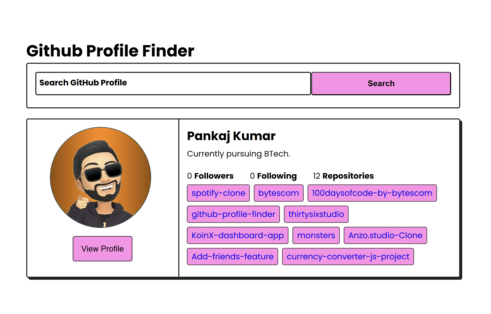

# 🔍 GitHub Profile Finder

A sleek web app that allows users to search any GitHub profile by username and view their profile information and public repositories in a beautiful interface.

🔗 **Live Demo**: [Click Here](https://bytescom.github.io/github-profile-finder/)

---

## 📸 Preview

---

## ✨ Features

- 🔍 Search GitHub users by username
- 👤 Displays avatar, followers, repo count
- 📦 Lists all public repositories as tags
- 📉 Visuals for language usage
- 💻 Responsive design using modern CSS

---

## 💻 Tech Stack

### 🚀 Frontend

| Technology | Badge |
|------------|--------|
| HTML5 |  |
| CSS3 |  |
| JavaScript |  |

### 🔧 Backend

| Technology | Badge |
|------------|--------|
| GitHub API |  |

---

# 🧑‍💻 Author

Developed by [@bytescom](https://github.com/bytescom).

Passionate about building functional, minimal, and accessible web apps for everyone.

---

## 📜 License

This project is licensed under the [MIT License](LICENSE) – see the LICENSE file for details.

---

## 📬 Contact

For questions or feedback:

- GitHub: [@bytescom](https://github.com/bytescom)
- Email: Kumarpankaj72863@gmail.com

---

